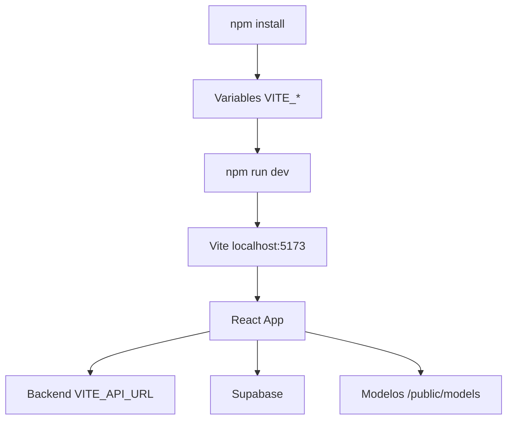

# 01. Inicio Rapido

## Objetivo

Levantar Nexa Vote Front localmente y conocer los scripts disponibles. Esta version contempla el estado de `main` y la adicion de Cypress en `Pruebas`.

## Requisitos

- Node.js 20 o compatible.
- Backend de Nexa Vote disponible.
- Proyecto Supabase configurado.
- Navegador moderno con soporte de camara y WebAuthn.
- Modelos de `face-api.js` publicados en `public/models`.

## Variables De Entorno

Crear `.env`:

```env
VITE_API_URL=http://localhost:3000
VITE_SUPABASE_URL=https://tu-proyecto.supabase.co
VITE_SUPABASE_ANON_KEY=tu_clave_anonima
```

`VITE_API_URL` es la base usada por `src/services/api.js`.

## Instalacion

```bash
npm install
npm run dev
```

La app corre normalmente en:

```text
http://localhost:5173
```

## Scripts

| Script | Descripcion |
| --- | --- |
| `npm run dev` | Inicia Vite en desarrollo. |
| `npm run build` | Genera build de produccion. |
| `npm run preview` | Sirve el build generado. |
| `npm run lint` | Ejecuta ESLint. |
| `npm run test:e2e` | Abre Cypress interactivo. |
| `npm run test:e2e:run` | Ejecuta Cypress headless. |

Los scripts `test:e2e` y `test:e2e:run` vienen de `Pruebas`.

## Docker

`Dockerfile`:

- Usa `node:20`.
- Instala dependencias.
- Recibe variables como `ARG`.
- Ejecuta `npm run build`.
- Expone puerto `10000`.
- Sirve con `vite preview`.

Ejemplo:

```bash
docker build \
  --build-arg VITE_API_URL=https://api.ejemplo.com \
  --build-arg VITE_SUPABASE_URL=https://tu-proyecto.supabase.co \
  --build-arg VITE_SUPABASE_ANON_KEY=tu_clave \
  -t nexa-vote-front .

docker run -p 10000:10000 nexa-vote-front
```

## Diagrama De Arranque



