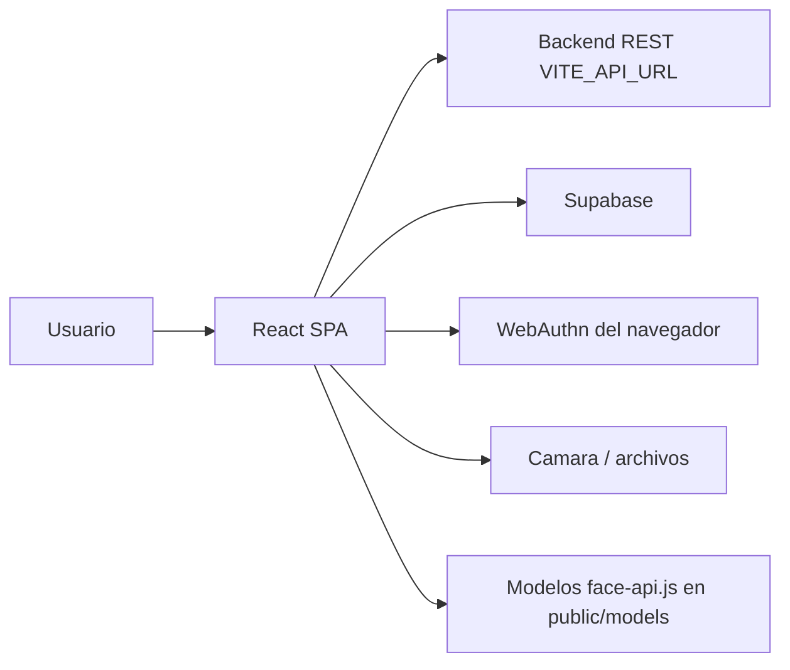

# 02. Arquitectura

## Vision General

Nexa Vote Front es una SPA de React. La aplicacion no contiene backend propio; consume un backend REST definido por `VITE_API_URL` y consulta Supabase directamente en la pantalla final de confirmacion de registro.

## Capas

| Capa | Ubicacion | Responsabilidad |
| --- | --- | --- |
| Entrada React | `src/main.jsx` | Monta `<App />` dentro de `#root`. |
| Rutas | `src/App.jsx` | Declara rutas publicas, registro, MFA, votacion y admin. |
| Servicios REST | `src/services/api.js` | Centraliza llamadas frecuentes al backend. |
| Configuracion API | `src/config/api.js` | Expone `import.meta.env.VITE_API_URL`. |
| Supabase | `src/lib/supabaseClient.js` | Crea cliente Supabase para consultas directas. |
| Contexto de registro | `src/context/*` | Mantiene `registrationId`, datos parciales y paso actual. |
| Paginas | `src/pages/*` | Pantallas completas de usuario y administrador. |
| Componentes UI | `src/pages/components/*` | Header, sidebar, footers y steppers reutilizados. |
| Estilos | `src/css/*`, `src/index.css` | CSS por pantalla y base global. |
| Modelos IA | `public/models/*` | Pesos y manifests usados por face-api.js. |

## Ruteo Principal

`src/App.jsx` usa `BrowserRouter`, `Routes` y `Route`. Tambien monta el `Toaster` de Sonner para notificaciones globales.

Ramas de rutas:

- Publico: `/`, `/login`.
- Registro: `/registro/*`.
- Admin: `/loginadmin`, `/admin/dashboard`, `/admin/resultados`, `/admin/votantes`.
- MFA: `/mfa/escaneo`, `/mfa/facial`, `/mfa/webauthn`.
- Votacion: `/candidatos`.

## Backend Y Datos

El backend se consume mediante `fetch`. Algunas llamadas estan en `src/services/api.js` y otras se hacen directamente desde pantallas especificas cuando el flujo necesita payloads particulares.

Supabase se usa de forma directa en:

- `src/test/supabaseTest.js`: prueba de conexion llamada desde la landing.
- `src/pages/registro/ConfirmacionRegistro.jsx`: lectura final de votante, biometria, credenciales WebAuthn y estado de registro; tambien actualiza el registro como completado.

## Estado Local

La aplicacion usa tres mecanismos:

- `useState` y `useRef` para estado de UI, camara, captura facial y formularios.
- `RegistrationProvider` para el flujo de registro.
- `localStorage` para tokens, usuario autenticado y banderas MFA.

## Assets Publicos

`public/models` contiene los modelos esperados por `face-api.js`. Las pantallas de reconocimiento facial cargan desde `/models`, por lo que esos archivos deben estar publicados junto al frontend.

Archivos publicos adicionales:

- `public/favicon.svg`
- `public/icons.svg`

## Consideraciones De Seguridad Arquitectonica

- El frontend no debe considerarse fuente de verdad para permisos ni estado de votacion.
- Las banderas en `localStorage` ayudan a navegar el flujo, pero el backend debe revalidar cada paso sensible.
- Los tokens se guardan en `localStorage`; esto exige buen control de XSS.
- WebAuthn requiere contexto seguro y validacion robusta del challenge en backend.

