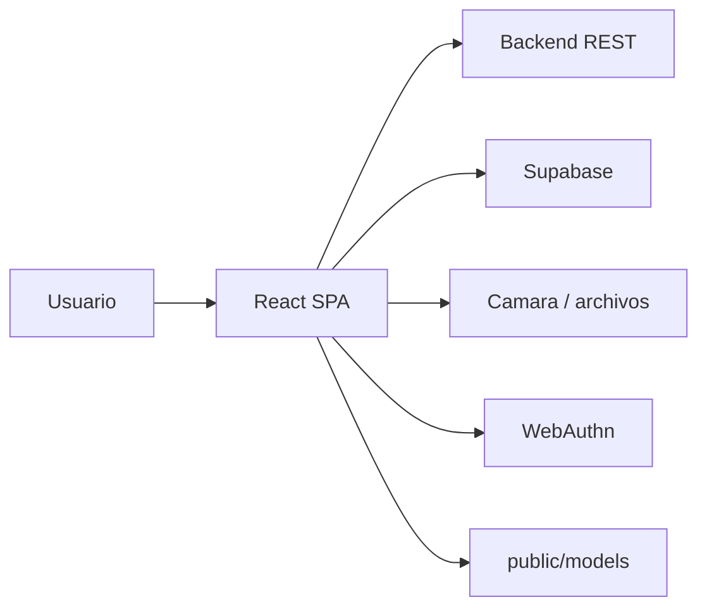
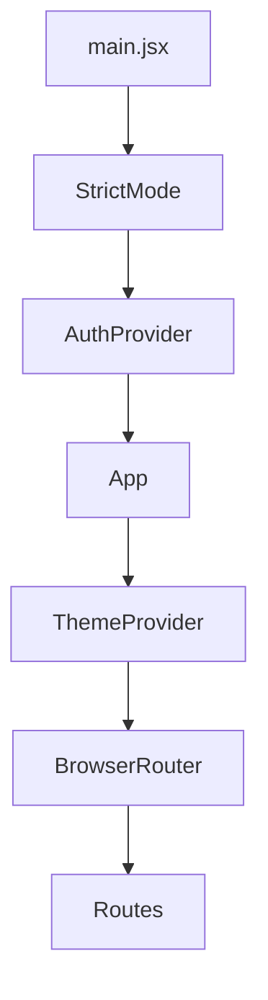
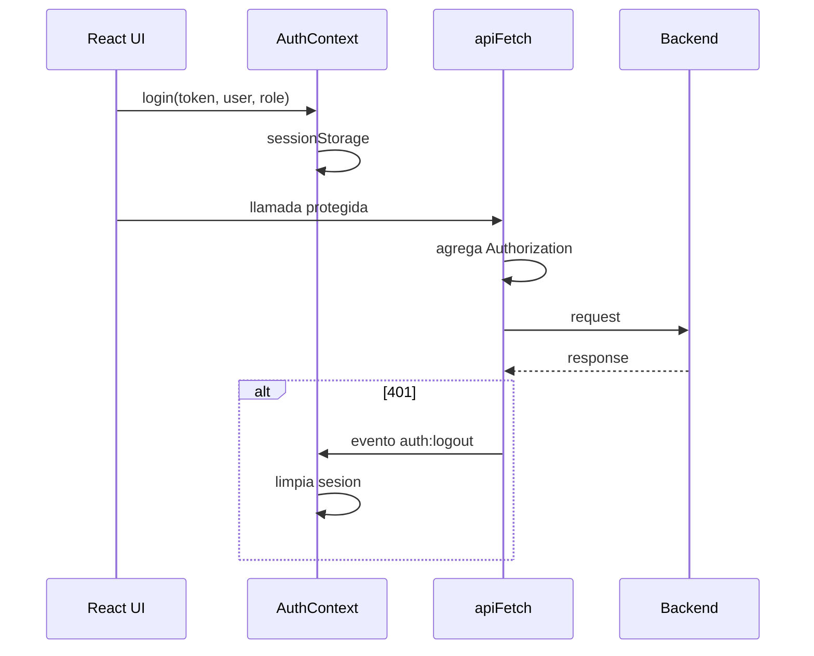

# 02. Arquitectura

## Vision General

Nexa Vote Front es una SPA React. No contiene backend propio; consume servicios REST mediante `VITE_API_URL`, conserva cliente Supabase y usa APIs del navegador para camara y WebAuthn.

## Providers Globales

## Capas

| Capa | Ubicacion | Responsabilidad |
| --- | --- | --- |
| Entrada | `src/main.jsx` | Monta React y `AuthProvider`. |
| Rutas | `src/App.jsx` | Define rutas, `ThemeProvider`, `Toaster` y guards. |
| Auth | `src/context/AuthContext.jsx` | Sesion, role, login/logout y rehidratacion. |
| Tema | `src/context/ThemeContext.jsx` | Tema claro/oscuro con `data-theme`. |
| Registro | `src/context/RegistrationProvider.jsx` | Estado del registro de votante. |
| API | `src/services/api.js` | Cliente REST centralizado con interceptor 401. |
| Supabase | `src/lib/supabaseClient.js` | Cliente Supabase. |
| Paginas | `src/pages/*` | Pantallas publicas, votante, registro y admin. |
| Componentes | `src/components/*` y `src/pages/components/*` | Guards, graficos, modales, layout y steppers. |
| Estilos | `src/css/*`, `src/index.css` | CSS global y por pantalla. |
| Pruebas | `cypress/*` | E2E agregado en `Pruebas`. |

## Flujo De Datos

## Cambios Relevantes Frente A La Documentacion Anterior

- Se agrego `AuthContext`.
- Se agrego `ProtectedRoute`.
- Se agrego `ThemeContext`.
- Se agrego ruta `/admin/auditoria`.
- Se agregaron `CandidatePieChart` y `ConfirmVotingModal`.
- Se centralizaron mas endpoints en `services/api.js`.
- `ConfirmacionRegistro` dejo de consultar tablas Supabase directamente y usa endpoints de backend.
- `Pruebas` agrega Cypress y scripts E2E.

