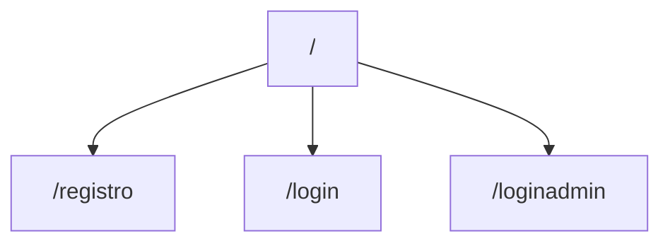
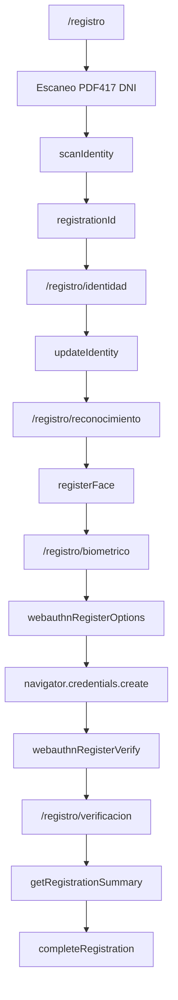
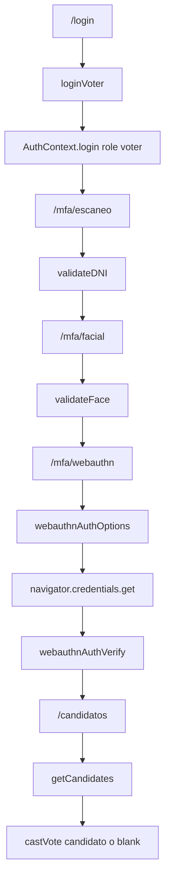
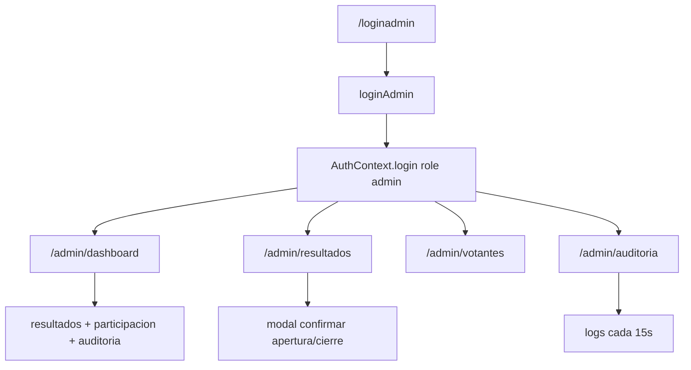

# 03. Rutas Y Flujos

## Tabla De Rutas

| Ruta | Componente | Proteccion | Descripcion |
| --- | --- | --- | --- |
| `/` | `Inicio` | Publica | Landing principal. |
| `/login` | `LoginVotante` | Publica | Login votante. |
| `/registro/*` | `RegistroLayout` | Publica | Registro de votante. |
| `/loginadmin` | `LoginAdmin` | Publica | Login admin. |
| `/admin/dashboard` | `AdminDashboard` | Admin | Dashboard. |
| `/admin/resultados` | `ControlVotacionAdmin` | Admin | Control de votacion. |
| `/admin/votantes` | `GestionVotantesAdmin` | Admin | Gestion de votantes. |
| `/admin/auditoria` | `AuditLogsAdmin` | Admin | Logs de auditoria. |
| `/mfa/escaneo` | `MFAPaso1DNI` | Votante | MFA DNI. |
| `/mfa/facial` | `MFAPaso2Facial` | Votante | MFA facial. |
| `/mfa/webauthn` | `MFAPaso3WebAuthn` | Votante | MFA WebAuthn. |
| `/candidatos` | `SeleccionCandidato` | Votante | Cedula de votacion. |

## Flujo Publico

## Flujo De Registro

## Flujo Login Votante Y Voto

## Flujo Admin

## Rutas Protegidas

`ProtectedRoute` decide:

- Sin sesion: redirige a `/login` o `/loginadmin`.
- Con `adminOnly`: exige `isAdmin`.
- Durante carga: renderiza `auth-loading`.

