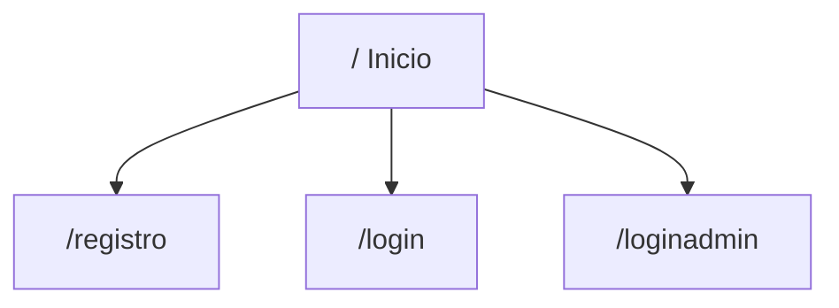
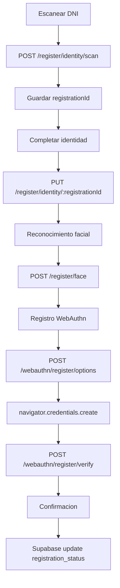
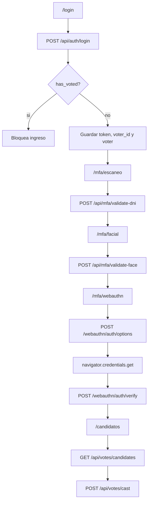
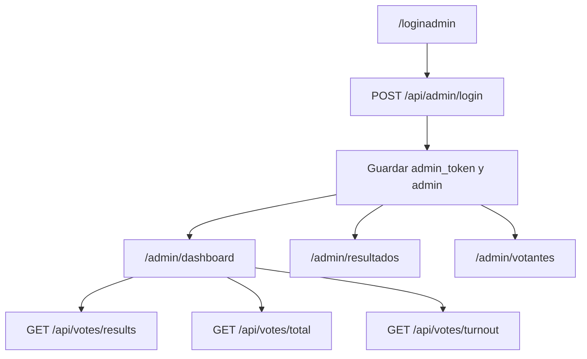

# 03. Rutas Y Flujos

## Tabla De Rutas

| Ruta | Componente | Descripcion |
| --- | --- | --- |
| `/` | `Inicio` | Pagina publica con CTA de registro y login. |
| `/login` | `LoginVotante` | Autenticacion de votante con DNI y password. |
| `/registro/*` | `RegistroLayout` | Subrutas del alta de votante. |
| `/registro/` | `RegistroEscaneDNI` | Escaneo PDF417 del reverso del DNI. |
| `/registro/identidad` | `RegistroIdentidad` | Completa fecha, email y password. |
| `/registro/reconocimiento` | `RegistroReconocimiento` | Captura descriptor facial con prueba de vida. |
| `/registro/biometrico` | `RegistroBiometrico` | Registro WebAuthn del dispositivo. |
| `/registro/verificacion` | `ConfirmacionRegistro` | Confirma datos en Supabase y finaliza registro. |
| `/loginadmin` | `LoginAdmin` | Autenticacion administrativa. |
| `/admin/dashboard` | `AdminDashboard` | Resultados, votos emitidos, participacion y auditoria mock. |
| `/admin/resultados` | `ControlVotacionAdmin` | Control visual del estado de votacion. |
| `/admin/votantes` | `GestionVotantesAdmin` | Vista mock de gestion de votantes. |
| `/mfa/escaneo` | `MFAPaso1DNI` | Validacion del DNI del votante autenticado. |
| `/mfa/facial` | `MFAPaso2Facial` | Validacion facial del votante autenticado. |
| `/mfa/webauthn` | `MFAPaso3WebAuthn` | Validacion WebAuthn antes de votar. |
| `/candidatos` | `SeleccionCandidato` | Lista candidatos y registra voto. |

## Flujo Publico

`Inicio.jsx` tambien ejecuta `testConnection()` contra Supabase al montar la pantalla. Esa llamada imprime datos y errores en consola.

## Flujo De Registro

Detalles:

- `RegistroEscaneDNI` lee PDF417 con `BrowserPDF417Reader`.
- `parsearDNI` extrae DNI y nombre completo desde el texto crudo.
- El backend devuelve `data.voter_id`; se guarda como `registrationId`.
- `RegistroIdentidad` recupera datos por `GET /register/voter/:registrationId`.
- `RegistroReconocimiento` carga modelos de face-api.js y captura 5 muestras validas.
- `RegistroBiometrico` usa WebAuthn para crear una credencial de plataforma.
- `ConfirmacionRegistro` lee tablas Supabase y solo permite finalizar si hay rostro y credencial WebAuthn.

## Flujo De Login Y Voto

Persistencia local usada por este flujo:

- `token`: JWT o token emitido por backend.
- `voter_id`: identificador del votante.
- `voter`: datos serializados del usuario.
- `dni_barcode_valid`: bandera esperada por los pasos MFA posteriores.
- `face_valid`: bandera marcada tras validacion facial.
- `fingerprint_valid`: bandera marcada tras validacion WebAuthn.

## Flujo Admin

Notas:

- `AdminDashboard` consume datos reales de resultados, total y participacion.
- `ControlVotacionAdmin` usa estado local para alternar `votingOpen`; no persiste el cambio en backend.
- `GestionVotantesAdmin` muestra datos mock definidos en el archivo.
- `AdminSidebar` elimina `admin_token` y `admin` al cerrar sesion.

