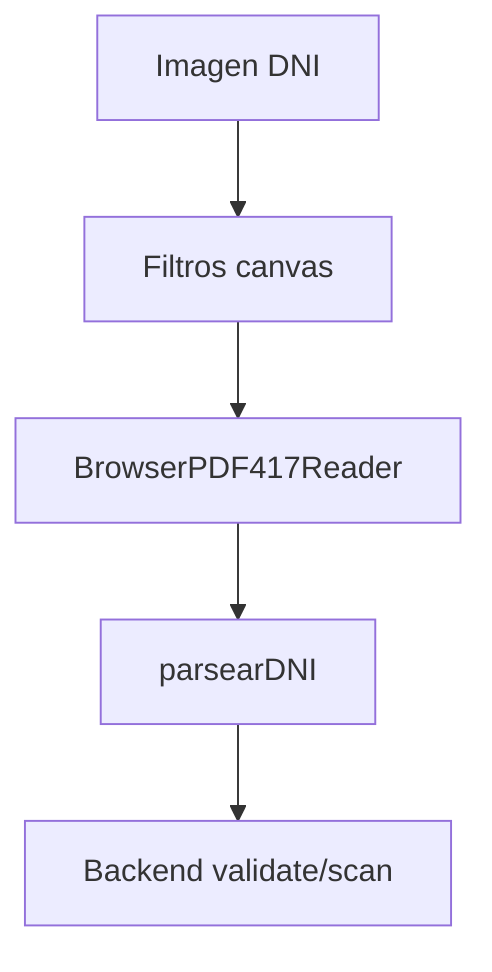
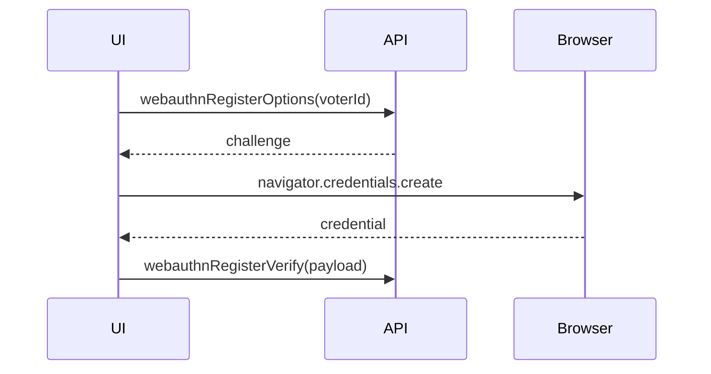
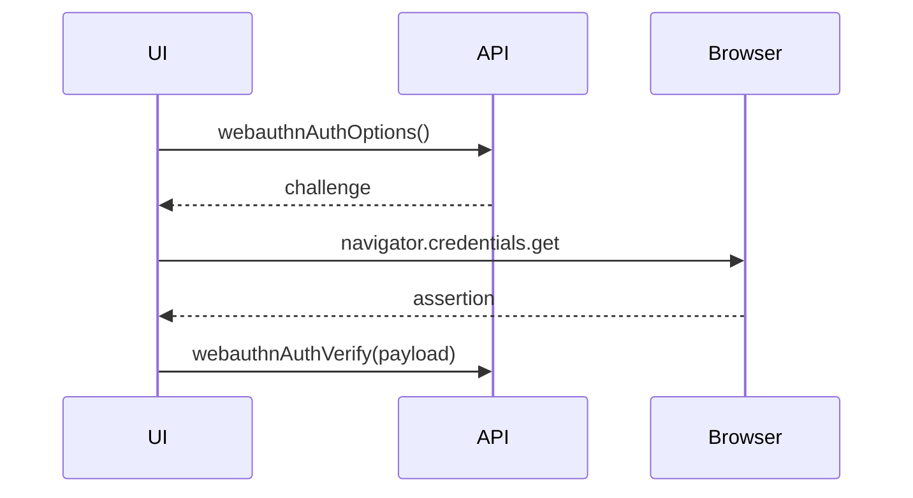

# 06. Biometria Y Seguridad

## DNI PDF417

Se usa `@zxing/browser` para leer PDF417 del reverso del DNI.

Pantallas:

- `RegistroEscaneDNI.jsx`
- `Mfapaso1dni.jsx`

Flujo:

## Reconocimiento Facial

Modelos cargados desde `/models`:

- `tinyFaceDetector`
- `faceLandmark68Net`
- `faceRecognitionNet`
- `faceExpressionNet`

Validaciones:

- Rostro detectado.
- Rostro suficientemente cerca.
- Rostro frontal.
- Cabeza recta.
- Liveness: izquierda, derecha y sonrisa.
- Captura de varias muestras.
- Promedio del descriptor facial.

## WebAuthn

Registro:

Autenticacion:

## Seguridad De Sesion

- La UI usa `sessionStorage` para token y usuario.
- `apiFetch` agrega `Authorization`.
- `apiFetch` limpia sesion ante 401.
- `ProtectedRoute` protege rutas en cliente.

El backend debe ser la autoridad final para:

- Token valido.
- Rol admin.
- Usuario habilitado.
- MFA completado.
- Voto unico.
- Challenge WebAuthn valido y no reutilizado.

## Riesgos

- `sessionStorage` no elimina riesgo XSS.
- Guards frontend no reemplazan validacion backend.
- WebAuthn requiere HTTPS o `localhost`.
- Modelos incompletos en `public/models` rompen facial.
- Camara y permisos del navegador pueden fallar.

