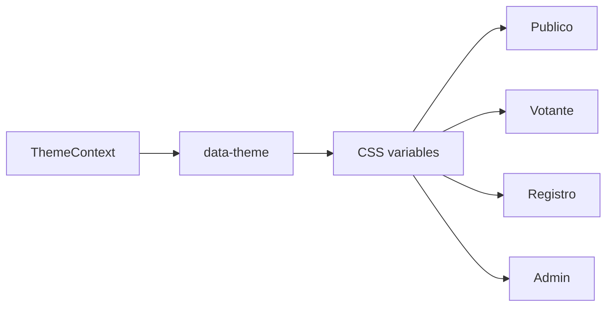

# 07. Estilos Y UI

## Tema

`ThemeContext` controla el tema:

- Guarda `theme` en `localStorage`.
- Aplica `data-theme` en `document.documentElement`.
- Expone `toggleTheme`.

## Variables Visuales

El estado actualizado usa variables como:

- `--bg-page`
- `--bg-glass`
- `--border`
- `--text-primary`
- `--text-secondary`

## Tipografias E Iconos

`index.html` carga:

- Inter.
- Space Grotesk.
- Material Symbols Outlined.

## Convenciones CSS

Los prefijos por pantalla siguen siendo:

- `in-`: inicio.
- `lv-`: login votante.
- `mfa1-`, `mfa2-`, `mfa3-`: MFA.
- `sc-`: seleccion candidato.
- `ri-`, `rr-`, `rb-`, `cr-`: registro.
- `la-`: login admin.

## UI Nueva O Relevante

- Toggle de tema en votacion y confirmacion de registro.
- Logout visible en cedula de votacion.
- Voto en blanco como tarjeta especial.
- Dashboard con grafico circular de participacion.
- Dashboard con grafico de candidatos.
- Modal de confirmacion para abrir/cerrar votacion.
- Vista dedicada de auditoria.

## Mapa Visual

## Recomendaciones

- Mover estilos inline admin a CSS o componentes.
- Consolidar colores en variables.
- Mantener idioma consistente.
- Eliminar assets heredados no usados si ya no aplican.

