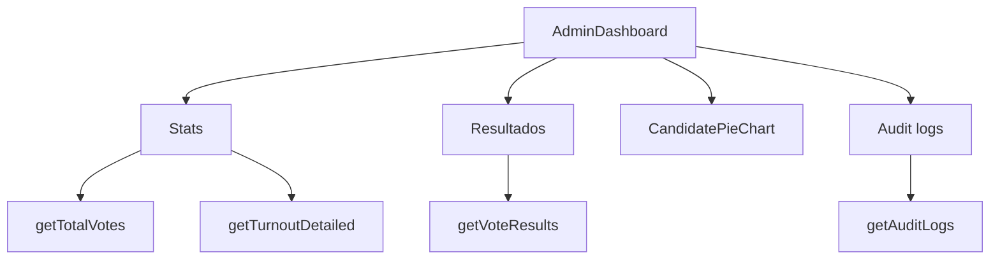
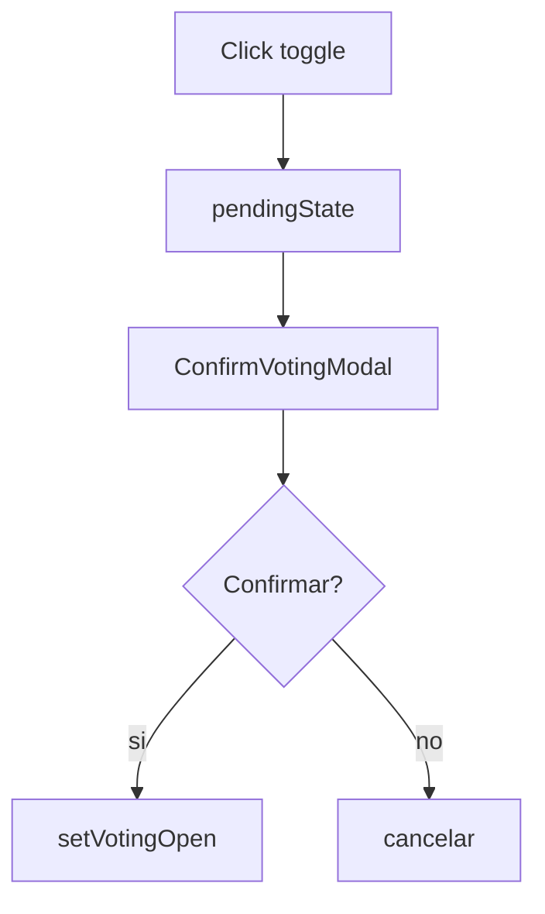

# 08. Admin Y Auditoria

## Dashboard

`AdminDashboard` consume:

- `getVoteResults`
- `getTotalVotes`
- `getTurnoutDetailed`
- `getAuditLogs`

Muestra:

- Estado de votacion.
- Total de votos.
- Total de votantes.
- Participacion.
- Resultados por candidato.
- Voto en blanco calculado.
- Grafico de participacion.
- Grafico de candidatos.
- Logs recientes.

## Auditoria

`AuditLogsAdmin`:

- Carga logs desde `getAuditLogs`.
- Refresca cada 15 segundos.
- Filtra por `all`, `success` y `fail`.
- Muestra fecha, accion, estado, IP, votante y metadata.

Tipos destacados:

- `VOTE_CAST`
- `VOTE_FAILED`
- `ADMIN_LOGIN`
- `FACE_VERIFIED`

## Control De Votacion

`ControlVotacionAdmin` usa `ConfirmVotingModal`.

Flujo:

Actualmente el cambio es local. Para produccion debe llamar backend y crear evento de auditoria.

## Gestion De Votantes

`GestionVotantesAdmin` presenta tabla, filtros, busqueda y acciones visuales. Parte del contenido sigue siendo mock o UI local.

## Sidebar Admin

`AdminSidebar` navega a:

- Dashboard.
- Live Results.
- Audit Logs.
- Voter Registry.

Tambien ejecuta logout y limpia sesion.

