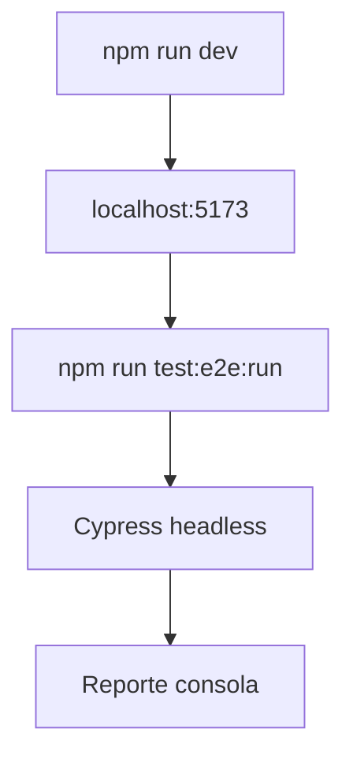

# 09. Pruebas E2E

## Origen

Las pruebas E2E fueron agregadas en la rama `Pruebas` antes del commit posterior que sumo k6. Esta seccion documenta solo Cypress; las pruebas de carga estan en `docs/11-pruebas-k6.md`.

## Dependencias Y Scripts

`package.json` agrega:

```json
{
  "test:e2e": "cypress open",
  "test:e2e:run": "cypress run"
}
```

Dev dependency:

```json
{
  "cypress": "^15.16.0"
}
```

## Configuracion

`cypress.config.js`:

- `baseUrl`: `http://localhost:5173`
- `viewportWidth`: `1280`
- `viewportHeight`: `720`

## Estructura

```text
cypress/
  e2e/
    admin-login.cy.js
    inicio.cy.js
    protected-routes.cy.js
    registro.cy.js
  fixtures/
    example.json
  support/
    commands.js
    e2e.js
```

## Cobertura Actual

| Test | Cobertura |
| --- | --- |
| `inicio.cy.js` | Landing carga y contiene textos esperados. |
| `admin-login.cy.js` | Formulario admin y bloqueo con credenciales falsas. |
| `protected-routes.cy.js` | Rutas admin protegidas sin login. |
| `registro.cy.js` | Pantalla de registro y validacion basica. |

## Flujo Recomendado



## Observacion

`protected-routes.cy.js` visita `/admin`, pero las rutas reales definidas son `/admin/dashboard`, `/admin/resultados`, `/admin/votantes` y `/admin/auditoria`. Conviene ajustar el test para usar rutas reales.
