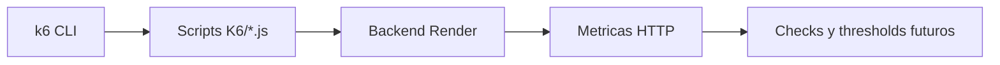
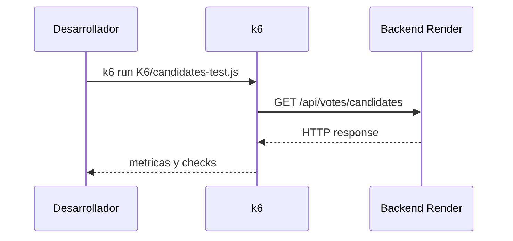

# 11. Pruebas k6

## Origen

La rama `Pruebas` recibio el commit `9d51ed5117a325f9d4168d01a6ca9b8f5d06eff5` con el mensaje `Se sube la carpeta de pruebas de K6`.

Ese commit agrega la carpeta `K6/` con scripts de carga y rendimiento contra el backend desplegado:

```text
https://nexa-vote-back.onrender.com
```

## Objetivo

Las pruebas k6 sirven para medir comportamiento del backend bajo concurrencia. A diferencia de Cypress, que valida flujos de UI, k6 valida resistencia, latencia y respuestas HTTP de endpoints.



## Archivos Agregados

| Archivo | Tipo | Endpoint |
| --- | --- | --- |
| `K6/health-test.js` | Health/load simple | `/` |
| `K6/candidates-test.js` | Carga progresiva | `/api/votes/candidates` |
| `K6/login-test.js` | Login concurrente | `/api/auth/login` |
| `K6/register-test.js` | Registro con datos aleatorios | `/register/identity` |
| `K6/stress-test.js` | Stress de registro | `/register/identity` |
| `K6/spike-test.js` | Pico rapido | `/api/votes/candidates` |

## Como Ejecutar

Instalar k6 segun el sistema operativo y ejecutar desde la raiz del repo:

```bash
k6 run K6/health-test.js
k6 run K6/candidates-test.js
k6 run K6/login-test.js
k6 run K6/register-test.js
k6 run K6/stress-test.js
k6 run K6/spike-test.js
```

## Escenarios

### `health-test.js`

- `vus`: 50
- `duration`: 1 minuto
- Endpoint: `/`

Sirve como prueba de disponibilidad basica del backend.

### `candidates-test.js`

Usa etapas:

| Duracion | Usuarios |
| --- | --- |
| 30s | 10 |
| 1m | 30 |
| 30s | 50 |
| 20s | 0 |

Incluye `check` para validar `status 200`.

### `login-test.js`

- `vus`: 5
- `duration`: 1 minuto
- Endpoint: `/api/auth/login`
- Payload actual: DNI y password hardcodeados.

### `register-test.js`

- `vus`: 2
- `duration`: 30 segundos
- Endpoint: `/register/identity`
- Genera DNI, nombre y email aleatorios.

### `stress-test.js`

Tiene la misma forma funcional que `register-test.js`: 2 VUs durante 30 segundos contra `/register/identity`.

### `spike-test.js`

Usa etapas:

| Duracion | Usuarios |
| --- | --- |
| 5s | 50 |
| 15s | 50 |
| 5s | 0 |

Ataca `/api/votes/candidates` para simular un pico breve de trafico.

## Flujo Recomendado



## Recomendaciones

- Parametrizar URL base con variables de entorno en lugar de dejar Render hardcodeado.
- No dejar credenciales reales en `login-test.js`.
- Agregar `thresholds` para latencia y tasa de error.
- Separar pruebas destructivas de registro para no llenar datos reales.
- Agregar checks a todos los scripts, no solo a `candidates-test.js`.
- Ejecutar k6 contra entornos de staging antes de produccion.

Ejemplo recomendado a futuro:

```js
const BASE_URL = __ENV.BASE_URL || 'http://localhost:3000';
```

Y ejecucion:

```bash
BASE_URL=https://nexa-vote-back.onrender.com k6 run K6/candidates-test.js
```
